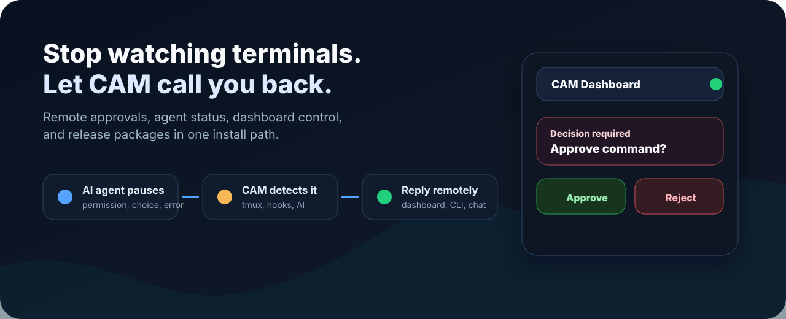
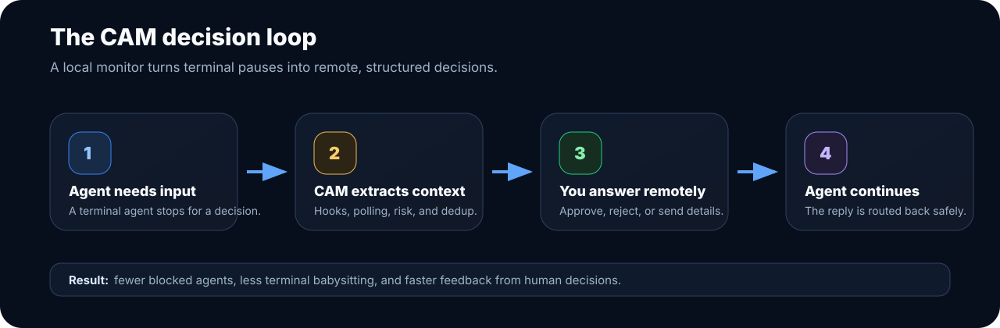
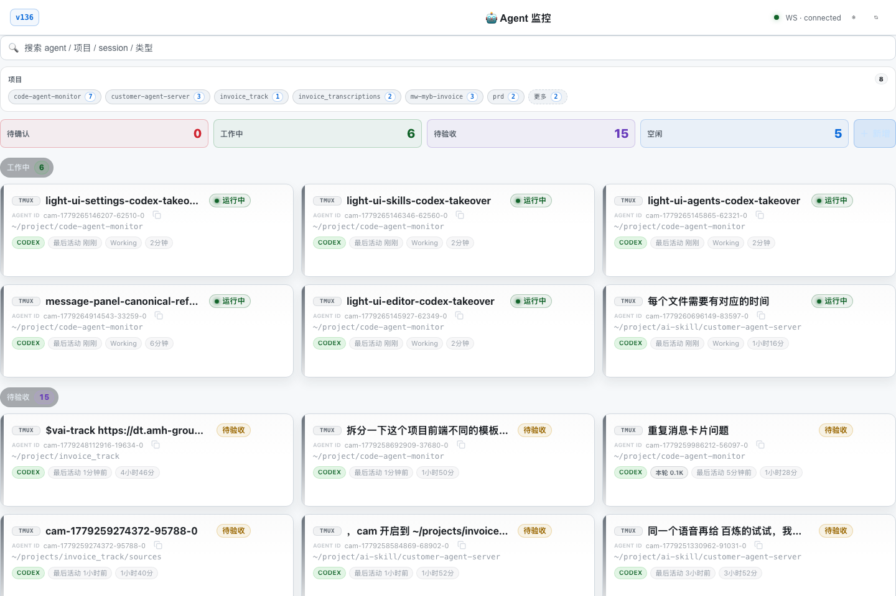
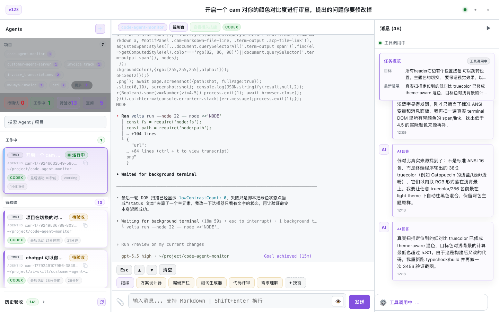

# CAM Releases

[English](README.md) | [中文](README.zh-CN.md)

<p align="center">
  
</p>

<p align="center">
  <a href="https://github.com/jcyLite/cam-releases/releases/latest"></a>
  <a href="https://github.com/jcyLite/cam-releases/releases/latest/download/install-remote.sh"></a>
  <a href="https://github.com/jcyLite/cam-releases/releases"></a>
</p>

CAM is the missing control room for AI coding agents. Claude Code, Codex,
Qoder, and other terminal agents are powerful, but they still stop for human
decisions: approve a command, choose an option, clarify intent, recover from an
error. CAM watches those pauses, turns them into structured decisions, and lets
you answer from a dashboard instead of babysitting terminal panes.

This repository is the public release channel for CAM binaries, installers, and
the Android dashboard package. The source repository can stay private; the
install experience stays simple.

## Install In One Command

```bash
curl -fsSL https://github.com/jcyLite/cam-releases/releases/latest/download/install-remote.sh | bash
```

The installer detects your platform, downloads the matching package, installs
`cam` into `~/.local/bin`, and places dashboard/plugin runtime assets in a
stable user directory.

For a fixed release:

```bash
curl -fsSL https://github.com/jcyLite/cam-releases/releases/download/v0.1.11/install-remote.sh | \
  CAM_INSTALL_RELEASE=v0.1.11 bash
```

Optional service install on macOS:

```bash
curl -fsSL https://github.com/jcyLite/cam-releases/releases/latest/download/install-remote.sh | \
  CAM_INSTALL_SERVICES=1 bash
```

## Why CAM Feels Different

<p align="center">
  
</p>

Most agent tooling starts the work. CAM keeps the work moving.

| When an agent pauses | What CAM does | What you do |
| --- | --- | --- |
| Permission confirmation | Detects the pending decision and risk context | Approve, reject, or send a custom answer |
| Design or implementation choice | Captures the relevant terminal state | Reply from the dashboard or CLI |
| Long-running task status | Tracks active, idle, waiting, and completed agents | Scan all agents without opening every pane |
| Multi-agent workflow | Groups team activity and pending messages | Route follow-ups to the right agent |

CAM is built around a practical loop:

```text
Agent needs input -> CAM detects it -> Dashboard shows the decision -> You reply -> Agent continues
```

## System Screenshots

The public package includes the same web dashboard runtime used by CAM locally:
agent status cards, project filters, pending decisions, terminal detail, and the
right-side message stream.

<p align="center">
  
</p>

<p align="center">
  
</p>

## What The Release Includes

Each complete release provides:

- `install-remote.sh`
- `cam-local-<version>-darwin-arm64.tar.gz`
- `cam-local-<version>-darwin-arm64.tar.gz.sha256`
- `cam-local-<version>-linux-x86_64.tar.gz`
- `cam-local-<version>-linux-x86_64.tar.gz.sha256`
- `cam-dashboard-<version>.apk`

The local package contains the CAM CLI, OpenClaw plugin runtime, bridge server,
and exported web dashboard assets needed for a remote-control setup.

## Android Dashboard

Download the Android dashboard APK from the latest release:

```bash
gh release download --repo jcyLite/cam-releases --pattern 'cam-dashboard-*.apk'
```

Then point the app at your CAM bridge address, for example:

```text
http://192.168.1.20:3456
```

Use the dashboard token shown by the CAM bridge when logging in.

## Release Checks

Inspect the latest public release:

```bash
gh release view --repo jcyLite/cam-releases --web
```

List release assets:

```bash
gh release view --repo jcyLite/cam-releases --json tagName,url,assets \
  --jq '{tagName,url,assets:[.assets[].name]}'
```

Verify an installed binary:

```bash
cam --version
cam service status
```

## Publishing

Releases are published from the source repository:

```bash
scripts/github-cam-release.sh --version 0.1.11 --android-version-code 11 --push
```

That workflow builds platform packages, uploads assets to this repository, and
keeps the public install URL stable:

```text
https://github.com/jcyLite/cam-releases/releases/latest/download/install-remote.sh
```
